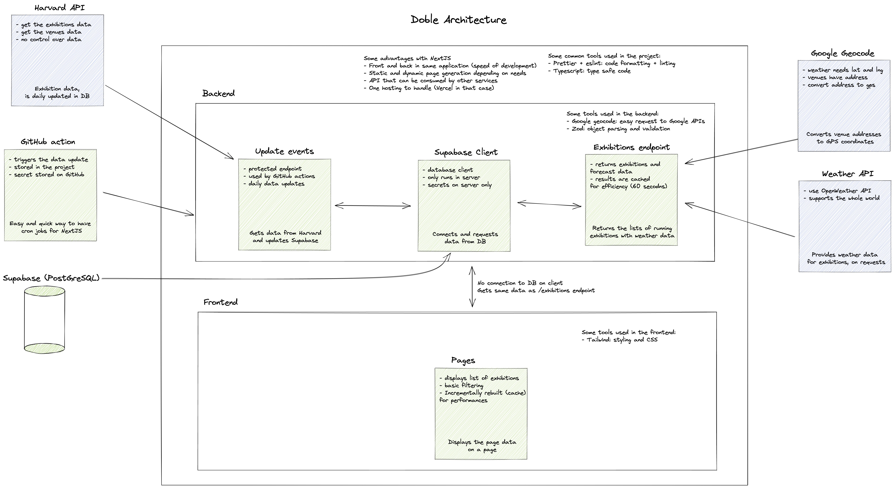

This project displays a list of running exhibitions with the weather forecast on venue's location.

It is called Doble, the Japanese name for the artist Pokémon, Queulorior in French and Smeargle in English.

---

It uses the following stack:

- [NextJS](https://nextjs.org/) for better control over data strategy and API integration
- [TypeScript](https://www.typescriptlang.org/) for type-safe requests
- [Tailwind](https://tailwindcss.com/) for easy and fast styling of the client

Data comes from:

- [Harvard API](https://github.com/harvardartmuseums/api-docs) for the exhibitions APIs
- [Google Geocode Service](https://developers.google.com/maps/documentation/javascript/geocoding) for getting GPS coordinates of venues
- [OpenWeather](https://openweathermap.org/) for weather forecasts

## Getting started

This project uses pnpm as package manager, we recommend using this package when running the project locally.

```bash
# installation
pnpm i

# development server
pnpm run dev
```

Open [http://localhost:3000](http://localhost:3000) with your browser to see the result.

## Hosting and data storage

The hosting of the project is done on [Vercel](https://vercel.com) and data are stored on [Supabase](https://supabase.com/)

## Project architecture

The architecture of the project is as follow:


